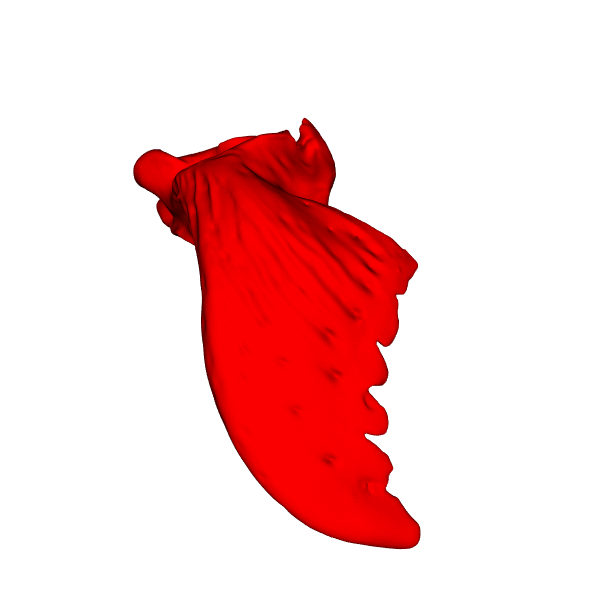

# Creating a 3D shape atlas using deformetrica
[Deformetrica](https://www.deformetrica.org/) is an open-source tool that allows comparison of shape objects, performing tasks such as shape registration, atlas construction, and geodesic regression. This tutorial walks through the Deterministic Atlas procedure which, given a set of shapes, determines a "mean" or template shape, and the deformation from this template to the individual shapes. For more information, please refer to the deformetrica [documentation](https://gitlab.com/icm-institute/aramislab/deformetrica/-/wikis/home).




## Getting Set-up:
### System Requirements:
1. Linux or Mac OS
2. Python(v.3.8) and Anaconda (Python package management system) installed, you can use the [miniconda](https://docs.conda.io/en/latest/miniconda.html) installation if not already installed.
3. [Paraview](https://www.paraview.org/): for visualising results, can display VTK files and quickly show animations
4. (Optional) Access to a GPU to speed up performance
5. (Optional) [MeshLab](https://www.meshlab.net/): for cleaning mesh files
6. (Optional) [MITK](https://www.mitk.org/wiki/The_Medical_Imaging_Interaction_Toolkit_(MITK)): if you need to place landmarks

### Data Requirements:
Deformetrica requires coarsley aligned *.vtk* mesh files. This tutorial starts from the object of interest already segmented from scans and saved as 3D mesh files. Please use a segmentation software of your choice to export as mesh file (preferably a VTK file, but can convert from STL or PLY). Or, if you have *.nii.gz* segmentations, you can follow the tutorial at the bottom to batch export all of your scans to mesh files.

## Getting Started:
1. Clone this repository to a local directory.

2. Create a new conda environment and install required packages using **requirements.txt**.
Open a terminal and run the following commands:
```
conda create --name ShapeAtlas python=3.8
conda activate ShapeAtlas
pip install -r requirements.txt
```

3. Organize your data directory (see **File Structure** section below).

4. Determine where to start the tutorial:
- Mesh files need cleaning and decimating: **go to 'Mesh Cleaning' section below**
- Mesh files not '.vtk': **go to step 1**
- Mesh files not aligned: **go to step 2**
- Mesh files aligned and saved as '.vtk': **go to step 3**


## Main Tutorial

#### 1. Convert mesh files to `.vtk` files
Ensure all of your mesh files are in one folder, saved as PLY or STL files. Open a terminal and run:
```
 python preprocessing/convert.py --input inputfolder --type filetype
 ``` 
where input folder is the folder with your mesh files, and filetype is the type of file to convert from ( enter *stl* or  *ply*). Files will be converted and saved in the input folder.


#### 2. Align mesh files
If mesh files are not scaled and aligned, place a few landmarks on each mesh file (not many needed for coarse alignment; usually 5-10 evenly distributed around the object). Landmarks should have point correspondence between objects and be placed in the same order on every object. There are many software options for placing landmarks, but [MITK](https://www.mitk.org/wiki/The_Medical_Imaging_Interaction_Toolkit_(MITK)) is open-source, allows input of VTK mesh files, and export of MPS landmark files.
Save your landmark files with the same name as your corresponding mesh file and as a 'mps' file. It is important your filenames closely match (**adding leading zeroes if you have double digit sample numbers!**) or the alignment will not work properly.

To align your files, run: 
```
python preprocessing/align.py [--config configfile] 
```
The meshes will be aligned and scaled, and then saved in the "model_runs" directory specified in the config file. This will also create an 'initial_template.vtk' that is simply your first sample in the list. 
    

#### 3. Create deformetrica files
Open up the 'parameters.csv' file to specify the parameters for your model run. This is what will alter how well the deformation fits your series of shapes. Important parameters to alter:
    - expname: enter the experiment name that is in your config file
    - object_id: the name of the objects that you are morphing
    - object_kernel_width and deformation_kernel_width: these are the parameters that will most impact your morphing. It will impact the number of control points on the surface, and thus how detailed your morphing is. Too large a number and there will be only a few control points, and overall movement in your shapes, not detailed movement. Too small and there will be small changes on the surface of your mesh files, but not an overall shift.
    - noise_std: how noisy the morphing is, generally set from 0.1 - 1
    - max_iterations and convergence_tolerance: these are related to the optimisation procedure and will determine when the model will stop running, with inital_step_size setting the progression at the start of the model.
    - template: specify one of your objects or another object as a template file, typically one that is close to an average of your objects is best

Additional parameter details are available [here](https://gitlab.com/icm-institute/aramislab/deformetrica/-/wikis/3_user_manual/3.4_optimization_parameters_xml_file).

After you have decided on a series of parameters for your run, as well as made sure your config file is up-to-date, open a terminal and run:
 ```
 python create_files.py [--config configfile]
 ```
The following xml files will be saved in your experiment folder:
    - model.xml: specifies the type of model, the kernel-width, object type, and template
    - data_set.xml: list of all of the objects to be included in the model
    - optimization_parameters.xml: parameters used in the model optimization procedure

#### 4. Run deformetrica
Before you run your model, make sure: 
 > _(1) All of your aligned mesh files are in your experiment directory. \
  (2) The mesh file names and paths match the files specified in 'data_set.xml'. \
  (3) All 3 XML files are in the experiment directory. \
  (4) The ShapeAtlas conda env is active._ 

Navigate into the model runs directory in a terminal and run: 
```
deformetrica estimate model.xml data_set.xml -p optimization_parameters.xml [--output outdirectory]
```
The first time this runs there will be a few calculations that take place. You know the program is running succesfully when you get this output:

[ PICTURE ]

Model results will be saved by default in an 'output' subdirectory. Please add an output flag (*--output* or *-o*) to specify directory.

Using CUDA? Refer to deformetrica's [page](https://gitlab.com/icm-institute/aramislab/deformetrica/-/wikis/3_user_manual/3.8_performance).

#### 5. Analyze morphing results
Within your model output folder there will be a series of files:
- The estimated template: `DeterministicAtlas_EstimatedParameters_Template.vtk`
- The location of the control points: `DeterministicAtlas__EstimatedParameters__ControlPoints.txt`
- The momenta for each object: `DeterministicAtlas__EstimatedParameters__Momenta.txt`
- The residuals of the fit: `DeterministicAtlas__EstimatedParameters__Residuals.txt`
- A series of 20 vtk files for each subject, progressing from the the template shape to the individual shape: `DeterministicAtlas_Flow_object_subject_samplename_0.vtk` -> `DeterministicAtlas_Flow_object_subject_samplename_19.vtk` 

For a first look at how well the morphing worked, open up the vtk files from 0 to 19 for a subject in Paraview. Paraview usually automatically groups files in a series together, so jut press the 'play' button to watch the morphing progress.

Alternatively, you can look at the final morphing shape for each sample (file ending in 19) and see how well that fits to the real data. After seeing how well the model performed, adjust your parameters (starting with kernel width) to try and get better results. 

## Other Details
### File Structure
To use the code as formatted, data files are expected to organized in a *data* folder in the following way. The segmentations folder is only needed if using batch conversion to mesh files, and the landmarks folder is only required if using the `align.py` function. Otherwise only a series of mesh files is needed in the mesh folder. 

```
data
|
|---segmentations
|   |  sample01.nii.gz
|   |  sample0n.nii.gz
|
|---landmarks
|   |  sample01.mps
|   |  sample0n.mps
|   
|---mesh
|   |  sample01.vtk
|   |  sample0n.vtk
```
### Troubleshooting


### Mesh Cleaning
Mesh cleaning can be performed using various functions in MeshLab and Blender. MeshLab is advantageous for its scripting capability, where you can create a filter script then apply this to multiple objects in the terminal. To create a filter script, open up your mesh file in the GUI, apply some filters, then savethe resulting script via "Filters"->"Show current filter" script. Some useful filters are "Remove Isolated Pieces", "Simplification: Quadric Edge Collapse Decimation", and 
"Laplacian Smooth" (or any of the other smoothing functions depending on your prefence). Once you have your filter script, you can apply to multiple objects in a folder by running the command: \
```
meshlabserver -i file.ply -o clean_file.ply -s filter_script.mlx
```
MeshLab doesn't work with vtk files, so the mesh files will need to be converted afterwards (*see step 1*). 

Blender is another open-source option, with many other functions, such as sculpting, which may be useful depending on the format of your data. 

### Batch export from segmentations to mesh files
...to be added later. 


## Citations:
- many of the functions and workflow built upon from:
Nicolas Toussaint, Yushi Redhead, Marta Vidal-Garcia, Lucas Lo Vercio, Wei Liu, Elizabeth Fisher, Benedikt Hallgrimsson, Victor Tybulewicz, Julia Schnabel, and Jeremy Green (2021) A landmark-free morphometrics pipeline for high-resolution phenotyping: application to a mouse model of Down Syndrome. Development 
(https://gitlab.com/ntoussaint/landmark-free-morphometry)
- 3D mesh deformation techniques:
Bône, A., Louis, M., Martin, B. and Durrleman, S., 2018, September. Deformetrica 4: an open-source software for statistical shape analysis. In International Workshop on Shape in Medical Imaging (pp. 3-13). Springer, Cham. (www.deformetrica.org/) 
